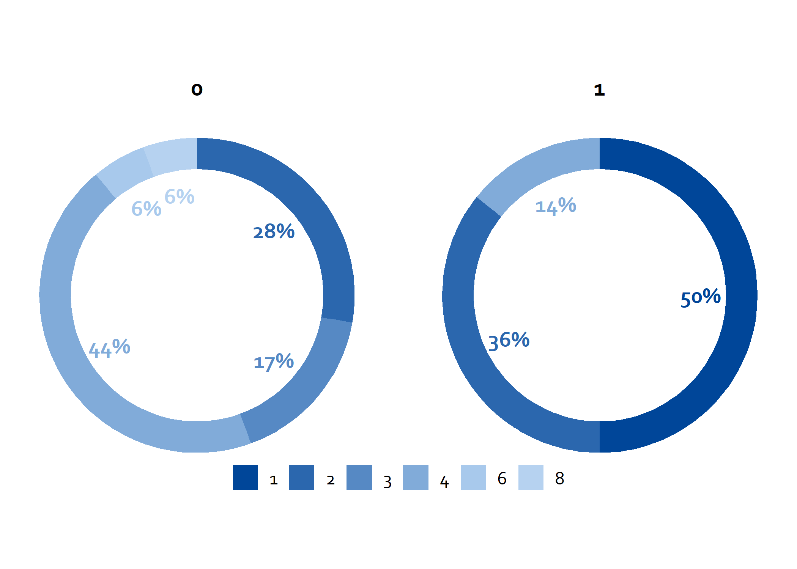
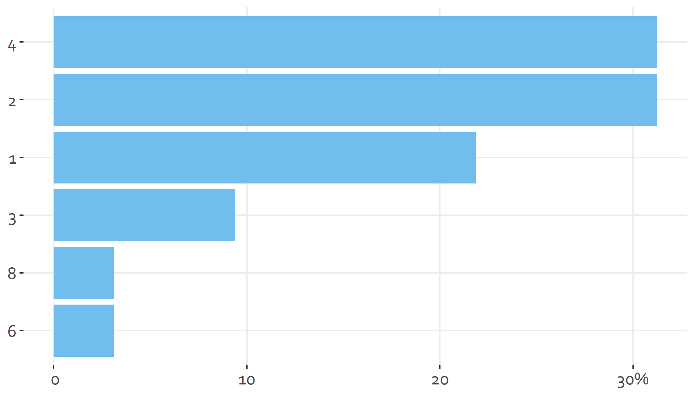

<!-- README.md is generated from README.Rmd. Please edit that file -->

# ggtheme.ois

De `{{ggtheme.ois}}` package is bedoeld om makkelijk plots te maken in
OIS-huistijl. Het uitgangspunt is om zo snel mogelijk van dataset naar
output te komen.

## Installation

De package kan als volgt worden geïnstalleerd van
[GitHub](https://github.com/):

``` r
# install.packages("devtools")
devtools::install_github("brilstl/ggtheme.ois")
#> WARNING: Rtools is required to build R packages, but is not currently installed.
#> 
#> Please download and install Rtools 4.0 from https://cran.r-project.org/bin/windows/Rtools/.
#> Downloading GitHub repo brilstl/ggtheme.ois@HEAD
#> tibble (3.1.3 -> 3.1.4) [CRAN]
#> Installing 1 packages: tibble
#> package 'tibble' successfully unpacked and MD5 sums checked
#> Warning: cannot remove prior installation of package 'tibble'
#> Warning in file.copy(savedcopy, lib, recursive = TRUE): problem copying C:
#> \Users\tbrils\Documents\R\R-4.1.0\library\00LOCK\tibble\libs\x64\tibble.dll
#> to C:\Users\tbrils\Documents\R\R-4.1.0\library\tibble\libs\x64\tibble.dll:
#> Permission denied
#> Warning: restored 'tibble'
#> 
#> The downloaded binary packages are in
#>  C:\Users\tbrils\AppData\Local\Temp\RtmpeyyuKF\downloaded_packages
#> WARNING: Rtools is required to build R packages, but is not currently installed.
#> 
#> Please download and install Rtools 4.0 from https://cran.r-project.org/bin/windows/Rtools/.
#>          checking for file 'C:\Users\tbrils\AppData\Local\Temp\RtmpeyyuKF\remotes1df46f6f1228\brilstl-ggtheme.ois-66cf481/DESCRIPTION' ...  v  checking for file 'C:\Users\tbrils\AppData\Local\Temp\RtmpeyyuKF\remotes1df46f6f1228\brilstl-ggtheme.ois-66cf481/DESCRIPTION'
#>       -  preparing 'ggtheme.ois':
#>    checking DESCRIPTION meta-information ...     checking DESCRIPTION meta-information ...   v  checking DESCRIPTION meta-information
#>       -  checking for LF line-endings in source and make files and shell scripts
#>       -  checking for empty or unneeded directories
#>      Omitted 'LazyData' from DESCRIPTION
#>       -  building 'ggtheme.ois_0.5.tar.gz'
#>      
#> 
```

## Example

Dit is een voorbeeld van een veel voorkomende plot binnen OIS:

``` r
library(ggtheme.ois)

likert_plot(.data = mtcars, y_as = gear, fill = carb)
```


De `facet = ...` functionaliteit kan worden toegepast om meerdere
groepen onafhankelijk in een plot te tonen. Deze variabelen moet tussen
aanhalingstekens worden doorgegeven aan de functie.

``` r
likert_plot(.data = mtcars, y_as = gear, fill = carb, facet = vs)
```


Een andere mogelijkheid is om een donut plot te maken. De syntax is
vergelijkbaar alleen dan natuurlijk zonder de y as.

``` r
donut_plot(.data = mtcars, fill = carb, facet = 'vs')
```



Een gewone bar plot kan ook gemaakt worden:

``` r
bar_plot(.data = mtcars, y_as = carb)
```


