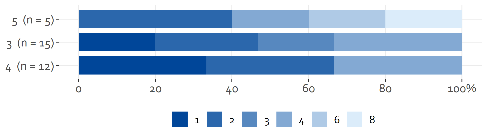

<!-- README.md is generated from README.Rmd. Please edit that file -->

# ggtheme.ois

De `{{ggtheme.ois}}` package is bedoeld om makkelijk plots te maken in
OIS-huistijl. Het uitgangspunt is om zo snel mogelijk van dataset naar
output te komen.

## Installation

De package kan als volgt worden geïnstalleerd van
[GitHub](https://github.com/):

``` r
# install.packages("devtools")
devtools::install_github("brilstl/ggtheme.ois")
```

## Example

Dit is een voorbeeld van een veel voorkomende plot binnen OIS:

``` r
library(ggtheme.ois)

likert_plot(.data = mtcars, y_as = gear, fill = carb)
```



De `facet = ...` functionaliteit kan worden toegepast om meerdere
groepen onafhankelijk in een plot te tonen. Deze variabelen moet tussen
aanhalingstekens worden doorgegeven aan de functie.

``` r
likert_plot(.data = mtcars, y_as = gear, fill = carb, facet = 'vs')
```


Een andere mogelijkheid is om een donut plot te maken. De syntax is
vergelijkbaar alleen dan natuurlijk zonder de y as.

``` r
donut_plot(.data = mtcars, fill = carb, facet = 'vs')
```


